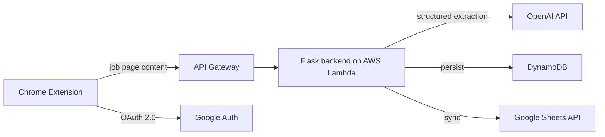

# ITrackApply

**LLM-powered job application tracker — a Chrome extension that captures job postings as you browse and syncs them to Google Sheets, automatically.**

🎬 **[Watch the demo](https://youtu.be/KrnUM2nuuWE?t=53)**

Tracking job applications in a spreadsheet by hand is tedious: copy the title, the company, the link, the date, the status... every single time. ITrackApply does it in one click. Open a job posting, hit the extension, and an LLM extracts the structured fields (company, role, location, deadline, source URL) and writes them to your personal Google Sheet — with everything synced to the cloud in real time.

## How it works

1. **Capture** — the extension grabs the posting content from the active tab.
2. **Extract** — a Flask backend running on AWS Lambda sends the content to an LLM, which returns structured fields (prompt built for cost efficiency: minimal tokens in, JSON out).
3. **Store & sync** — records persist to DynamoDB and sync to the user's Google Sheet via the Sheets API, so the spreadsheet is always the up-to-date view.
4. **Auth** — Google OAuth 2.0; the extension only touches the user's own sheet.

## Tech stack

| Layer | Technology |
|---|---|
| Frontend | Chrome extension (JavaScript) |
| API | AWS API Gateway |
| Backend | Python Flask on AWS Lambda |
| Storage | DynamoDB |
| Sync | Google Sheets API |
| Auth | OAuth 2.0 |
| Extraction | OpenAI API |

## Why the code isn't all here

The production backend is deployed on AWS (Lambda + API Gateway + DynamoDB); The demo video above shows the full system running end to end.

## What I'd build next

- Duplicate detection when the same posting is captured from multiple job boards
- Batch backfill from an email inbox
